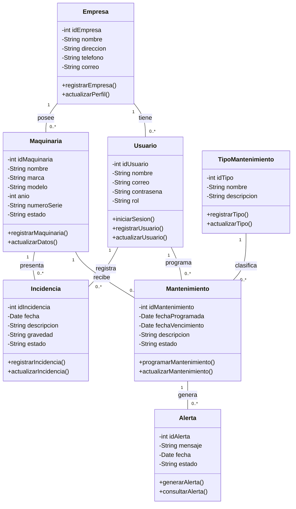
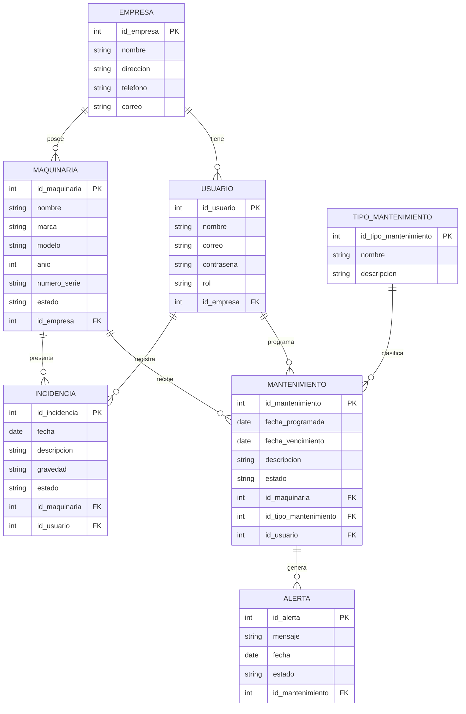

# Sistema de Mantenimiento de Maquinaria AgroTech

## 1. Diagrama de Clases

```mermaid
classDiagram
    class Usuario {
        -int idUsuario
        -String nombre
        -String correo
        -String contrasena
        -String rol
        +iniciarSesion()
        +registrarUsuario()
        +actualizarUsuario()
    }

    class Empresa {
        -int idEmpresa
        -String nombre
        -String direccion
        -String telefono
        -String correo
        +registrarEmpresa()
        +actualizarPerfil()
    }

    class Maquinaria {
        -int idMaquinaria
        -String nombre
        -String marca
        -String modelo
        -int anio
        -String numeroSerie
        -String estado
        +registrarMaquinaria()
        +actualizarDatos()
    }

    class TipoMantenimiento {
        -int idTipo
        -String nombre
        -String descripcion
        +registrarTipo()
        +actualizarTipo()
    }

    class Mantenimiento {
        -int idMantenimiento
        -Date fechaProgramada
        -Date fechaVencimiento
        -String descripcion
        -String estado
        +programarMantenimiento()
        +actualizarMantenimiento()
    }

    class Alerta {
        -int idAlerta
        -String mensaje
        -Date fecha
        -String estado
        +generarAlerta()
        +consultarAlerta()
    }

    class Incidencia {
        -int idIncidencia
        -Date fecha
        -String descripcion
        -String gravedad
        -String estado
        +registrarIncidencia()
        +actualizarIncidencia()
    }

    Empresa "1" -- "0..*" Usuario : tiene
    Empresa "1" -- "0..*" Maquinaria : posee
    Maquinaria "1" -- "0..*" Mantenimiento : recibe
    TipoMantenimiento "1" -- "0..*" Mantenimiento : clasifica
    Mantenimiento "1" -- "0..*" Alerta : genera
    Maquinaria "1" -- "0..*" Incidencia : presenta
    Usuario "1" -- "0..*" Mantenimiento : programa
    Usuario "1" -- "0..*" Incidencia : registra
```

---

## 2. Diagrama Entidad-Relación (DER)

```mermaid
erDiagram
    EMPRESA {
        int id_empresa PK
        string nombre
        string direccion
        string telefono
        string correo
    }

    USUARIO {
        int id_usuario PK
        string nombre
        string correo
        string contrasena
        string rol
        int id_empresa FK
    }

    MAQUINARIA {
        int id_maquinaria PK
        string nombre
        string marca
        string modelo
        int anio
        string numero_serie
        string estado
        int id_empresa FK
    }

    TIPO_MANTENIMIENTO {
        int id_tipo_mantenimiento PK
        string nombre
        string descripcion
    }

    MANTENIMIENTO {
        int id_mantenimiento PK
        date fecha_programada
        date fecha_vencimiento
        string descripcion
        string estado
        int id_maquinaria FK
        int id_tipo_mantenimiento FK
        int id_usuario FK
    }

    ALERTA {
        int id_alerta PK
        string mensaje
        date fecha
        string estado
        int id_mantenimiento FK
    }

    INCIDENCIA {
        int id_incidencia PK
        date fecha
        string descripcion
        string gravedad
        string estado
        int id_maquinaria FK
        int id_usuario FK
    }

    EMPRESA ||--o{ USUARIO : "tiene"
    EMPRESA ||--o{ MAQUINARIA : "posee"
    MAQUINARIA ||--o{ MANTENIMIENTO : "recibe"
    TIPO_MANTENIMIENTO ||--o{ MANTENIMIENTO : "clasifica"
    USUARIO ||--o{ MANTENIMIENTO : "programa"
    MANTENIMIENTO ||--o{ ALERTA : "genera"
    MAQUINARIA ||--o{ INCIDENCIA : "presenta"
    USUARIO ||--o{ INCIDENCIA : "registra"
```