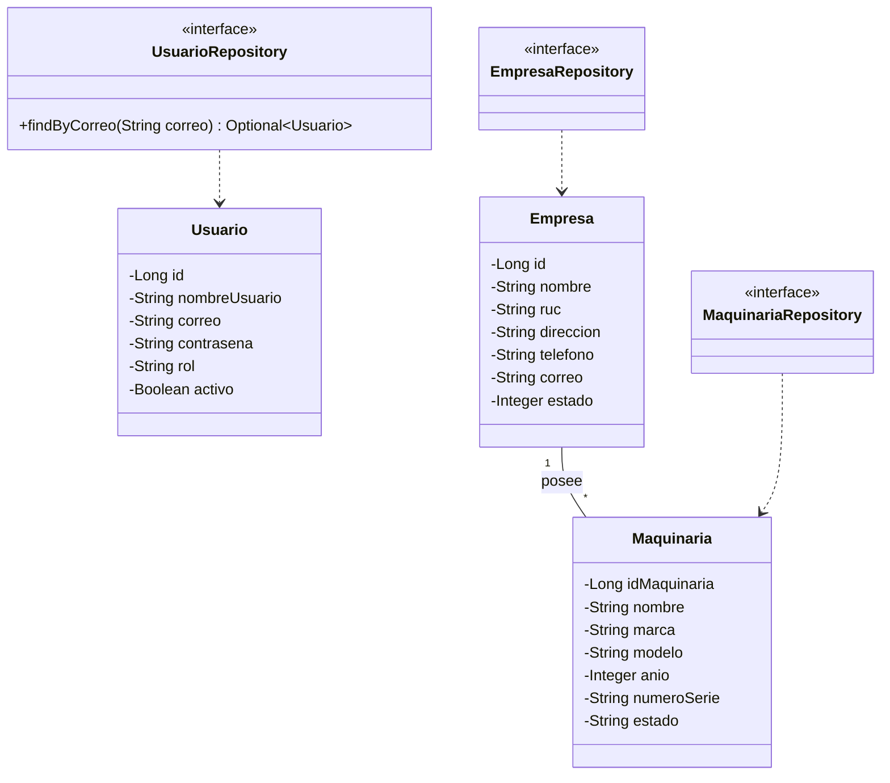

```mermaid
classDiagram
    class Usuario {
        -Long id
        -String nombreUsuario
        -String correo
        -String contrasena
        -String rol
        -Boolean activo
    }

    class Empresa {
        -Long id
        -String nombre
        -String ruc
        -String direccion
        -String telefono
        -String correo
        -Integer estado
    }

    class Maquinaria {
        -Long idMaquinaria
        -String nombre
        -String marca
        -String modelo
        -Integer anio
        -String numeroSerie
        -String estado
    }

    class UsuarioRepository {
        <<interface>>
        +findByCorreo(String correo) Optional~Usuario~
    }

    class EmpresaRepository {
        <<interface>>
    }

    class MaquinariaRepository {
        <<interface>>
    }

    Empresa "1" -- "*" Maquinaria : posee
    UsuarioRepository ..> Usuario
    EmpresaRepository ..> Empresa
    MaquinariaRepository ..> Maquinaria
```