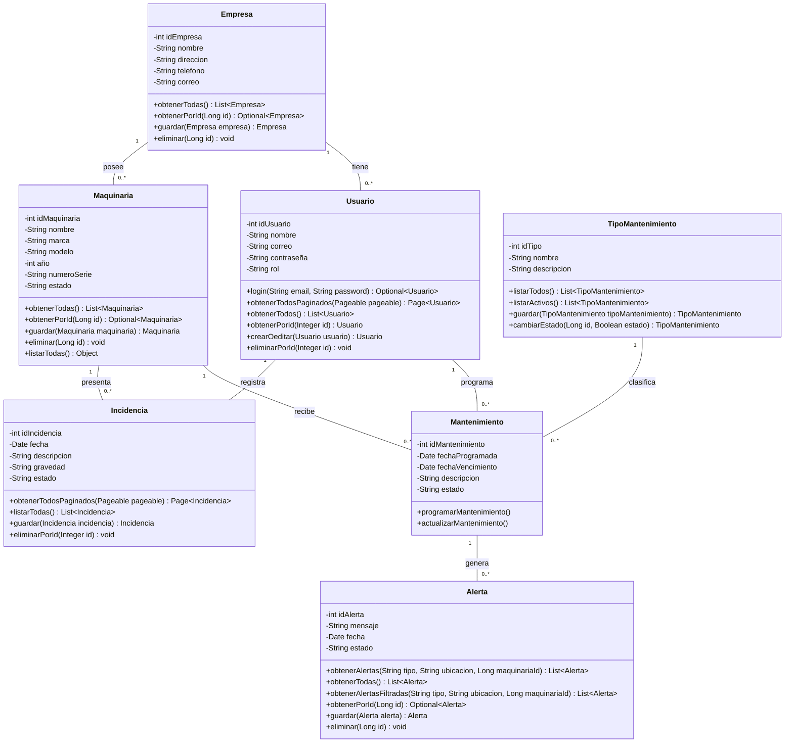

```mermaid
classDiagram
    title AgroTech - Diagrama de Clases

    class Usuario {
        -int idUsuario
        -String nombre
        -String correo
        -String contraseña
        -String rol
        +login(String email, String password) Optional~Usuario~
        +obtenerTodosPaginados(Pageable pageable) Page~Usuario~
        +obtenerTodos() List~Usuario~
        +obtenerPorId(Integer id) Usuario
        +crearOeditar(Usuario usuario) Usuario
        +eliminarPorId(Integer id) void
    }

    class Empresa {
        -int idEmpresa
        -String nombre
        -String direccion
        -String telefono
        -String correo
        +obtenerTodas() List~Empresa~
        +obtenerPorId(Long id) Optional~Empresa~
        +guardar(Empresa empresa) Empresa
        +eliminar(Long id) void
    }

    class Maquinaria {
        -int idMaquinaria
        -String nombre
        -String marca
        -String modelo
        -int año
        -String numeroSerie
        -String estado
        +obtenerTodas() List~Maquinaria~
        +obtenerPorId(Long id) Optional~Maquinaria~
        +guardar(Maquinaria maquinaria) Maquinaria
        +eliminar(Long id) void
        +listarTodas() Object
    }

    class TipoMantenimiento {
        -int idTipo
        -String nombre
        -String descripcion
        +listarTodos() List~TipoMantenimiento~
        +listarActivos() List~TipoMantenimiento~
        +guardar(TipoMantenimiento tipoMantenimiento) TipoMantenimiento
        +cambiarEstado(Long id, Boolean estado) TipoMantenimiento
    }

    class Mantenimiento {
        -int idMantenimiento
        -Date fechaProgramada
        -Date fechaVencimiento
        -String descripcion
        -String estado
        +programarMantenimiento()
        +actualizarMantenimiento()
    }

    class Alerta {
        -int idAlerta
        -String mensaje
        -Date fecha
        -String estado
        +obtenerAlertas(String tipo, String ubicacion, Long maquinariaId) List~Alerta~
        +obtenerTodas() List~Alerta~
        +obtenerAlertasFiltradas(String tipo, String ubicacion, Long maquinariaId) List~Alerta~
        +obtenerPorId(Long id) Optional~Alerta~
        +guardar(Alerta alerta) Alerta
        +eliminar(Long id) void
    }

    class Incidencia {
        -int idIncidencia
        -Date fecha
        -String descripcion
        -String gravedad
        -String estado
        +obtenerTodosPaginados(Pageable pageable) Page~Incidencia~
        +listarTodas() List~Incidencia~
        +guardar(Incidencia incidencia) Incidencia
        +eliminarPorId(Integer id) void
    }

    Empresa "1" -- "0..*" Usuario : tiene
    Empresa "1" -- "0..*" Maquinaria : posee
    Maquinaria "1" -- "0..*" Mantenimiento : recibe
    TipoMantenimiento "1" -- "0..*" Mantenimiento : clasifica
    Mantenimiento "1" -- "0..*" Alerta : genera
    Maquinaria "1" -- "0..*" Incidencia : presenta
    Usuario "1" -- "0..*" Mantenimiento : programa
    Usuario "1" -- "0..*" Incidencia : registra
```